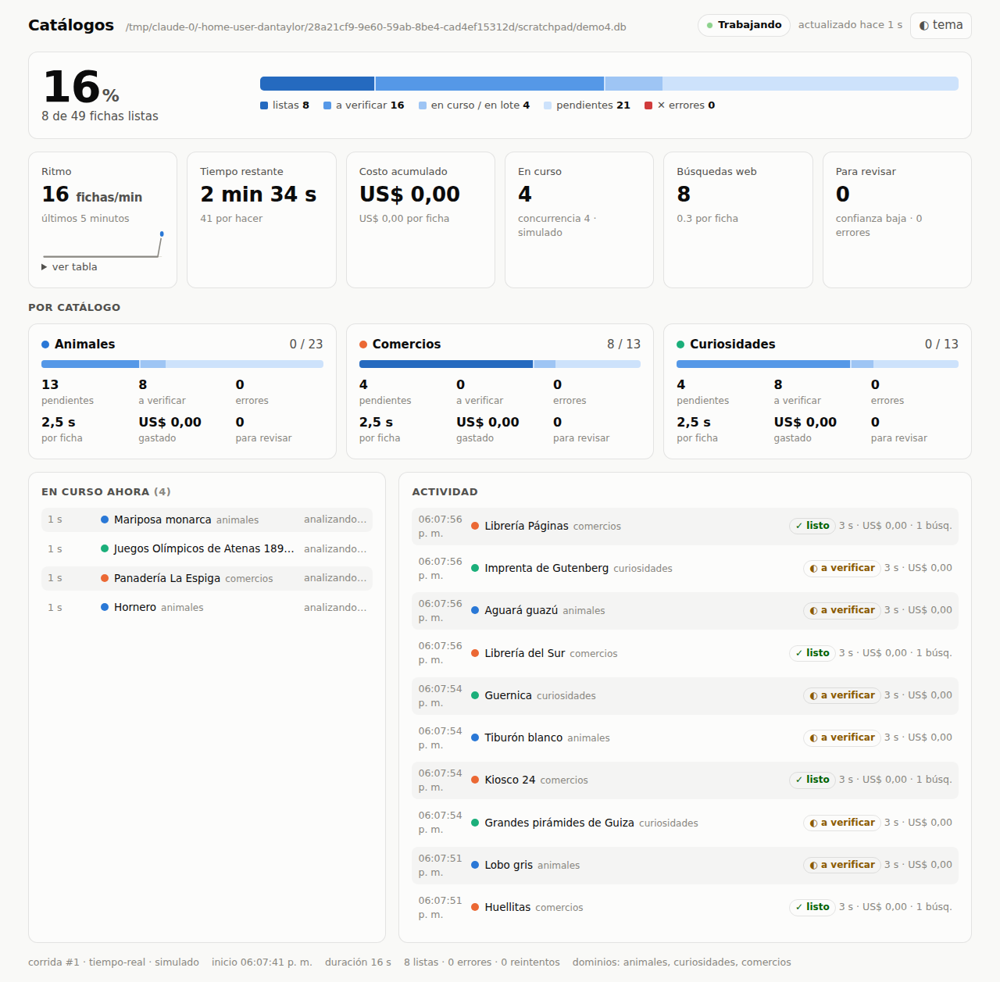

# Catálogos: motor compartido de análisis en paralelo

Un solo motor para recolectar, analizar con Claude **en paralelo** y ordenar
dos proyectos de catálogo:

- **enciclopedias**: `animales` y `curiosidades` (arte, deporte, ciencia, historia);
- **comercios**: supermercados, librerías, almacenes, farmacias...

Con un **panel visual** local que muestra progreso, ritmo, costo, tiempo
restante, qué se está analizando ahora y la actividad reciente.



Documentos:

- [docs/ARQUITECTURA.md](docs/ARQUITECTURA.md): qué se comparte entre catálogos, qué no, y qué se tomó del mundo de los supermercados.
- [docs/LOGISTICA_PARALELA.md](docs/LOGISTICA_PARALELA.md): costos, límites, las dos vías de ejecución (cuenta o clave de API), las dos pasadas, el plan por etapas.
- [docs/INFORME_PARA_CLAUDE_LOCAL.md](docs/INFORME_PARA_CLAUDE_LOCAL.md): instrucciones para la sesión de Claude que integre esto con los proyectos reales en la computadora.

## Instalación

```bash
python -m venv .venv && source .venv/bin/activate
pip install -e ".[dev]"
pytest          # 94 tests, sin red
```

## Probar sin costo (modo simulado)

```bash
python -m catalogo ingerir animales ejemplos/animales/wikipedia.csv ejemplos/animales/gbif.jsonl
python -m catalogo ingerir curiosidades ejemplos/curiosidades/wikipedia.csv
python -m catalogo ingerir comercios ejemplos/comercios/web.csv ejemplos/comercios/relevamiento.csv

python -m catalogo panel --abrir       # en otra terminal: http://127.0.0.1:8765

# los tres dominios a la vez, 4 trabajadores, 2,5 s simulados por item (para ver el panel moverse)
python -m catalogo analizar animales curiosidades comercios --simulado --latencia-simulada 2.5 --concurrencia 4

python -m catalogo catalogar animales curiosidades comercios --salida salida
python -m catalogo estado
```

Resultado en `salida/<dominio>/catalogo.md` (legible), `catalogo.json` (árbol
con facetas y cola de revisión) y `fichas.jsonl` (una ficha por línea).

## Con Claude Code local (tu cuenta, sin clave de API)

```bash
# empezar con una muestra chica, con el panel abierto
python -m catalogo analizar animales --claude-code --limite 20 --concurrencia 3

# los dos catálogos a la vez; el resumen también se escribe a un archivo para otros programas
python -m catalogo analizar animales curiosidades comercios --claude-code --concurrencia 3 --estado-json estado.json

# fichas ya hechas en otro sistema: entran como listas y no se vuelven a pagar
python -m catalogo importar animales fichas_viejas.jsonl --fuente catalogo-viejo
```

`--claude-code` lanza `claude -p` N veces a la vez con la ficha validada
contra el esquema del dominio (`--json-schema`), herramientas limitadas a
búsqueda web, tope de turnos y de gasto por item. Concurrencia 2-4: más se topa
con el límite del plan, y el motor pausa solo cuando eso pasa.

## Con la API de Claude (clave)

```bash
export ANTHROPIC_API_KEY=...
python -m catalogo analizar animales curiosidades comercios --concurrencia 16 --por-minuto 300 --max-costo 20

# volumen grande: Message Batches (50 % más barato, resultados en < 24 h)
python -m catalogo analizar animales --modo lotes --no-esperar
python -m catalogo recoger animales          # más tarde, o en otra máquina con la misma base

# lo que falló o fue rechazado, otra vez en tiempo real
python -m catalogo estado animales --errores
python -m catalogo analizar animales --reintentar-errores --modo tiempo-real
```

## Política web por dominio

| Dominio | Política | Qué pasa |
|---|---|---|
| animales, curiosidades | `si_dudoso` | Pasada 1 sin web (barata, en lote si hay volumen). Pasada 2 con web solo para lo que quedó con confianza media/baja o con campos volátiles vacíos (p. ej. estado UICN). |
| comercios | `siempre` | Una pasada con web, máximo 3 búsquedas, con la ciudad y el barrio en la consulta. |

`--sin-web` desactiva todo esto para una corrida.

## Estructura

```
catalogo/
  core/            motor compartido (no sabe de animales ni de comercios)
    paralelo.py      trabajadores asyncio, límite de ritmo, reintentos, pausa ante 429, tope
    almacen.py       SQLite: estados, huellas, TTL, lotes, fuentes, métricas, corridas, eventos
    analizador.py    simulado · API de Claude (con web) · Message Batches · claude -p
    pipeline.py      ingerir → importar → analizar (dos pasadas) → catalogar; estado.json
    panel.py/.html   panel visual: servidor HTTP local + /api/estado
    taxonomia.py     árbol de categorías (vocabulario controlado + orden)
    catalogo.py      identidad final, orden, árbol, facetas, cola de revisión, exportación
    texto.py         normalización de texto y medidas
  dominios/        una clase por catálogo: animales, curiosidades, comercios
ejemplos/          datos de muestra, una carpeta por dominio y un archivo por fuente
tests/             pytest, sin red (dobles del cliente de la API y de `claude -p`)
```
